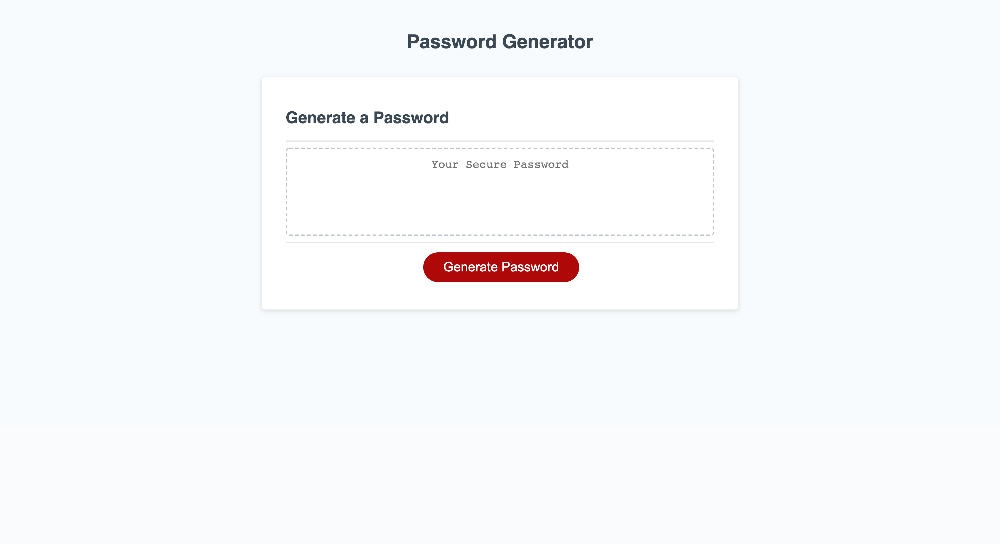

# random-password-generator

This is a random password generator powered by vanilla Javascript. It's designed to create secure passwords that can be used for various accounts.

## Table of Contents

- [Installation](#installation)
- [Usage](#usage)
- [Credits](#credits)
- [License](#license)

## Installation

N/A

## Usage

This page can be accessed and used on any standard web browser. After pressing a button and using confirm, alert, and prompt windows, the user can decide how long the password can be and what types of characters it should contain. The returned random password appears in a textbox that can be copied and pasted from.

## Credits

W3 School's pages on [For Loops](https://www.w3schools.com/js/js_loop_for.asp) and [Math.random](https://www.w3schools.com/js/js_random.asp) were most helpful to building this application.

## License

Creative Commons License: This work can be used by others as long as credit is given.

The application can be viewed here: [https://liaobrien.github.io/random-password-generator/](https://liaobrien.github.io/random-password-generator).
